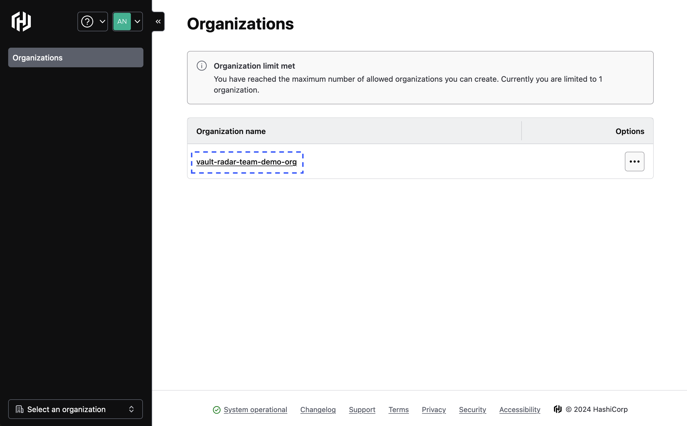
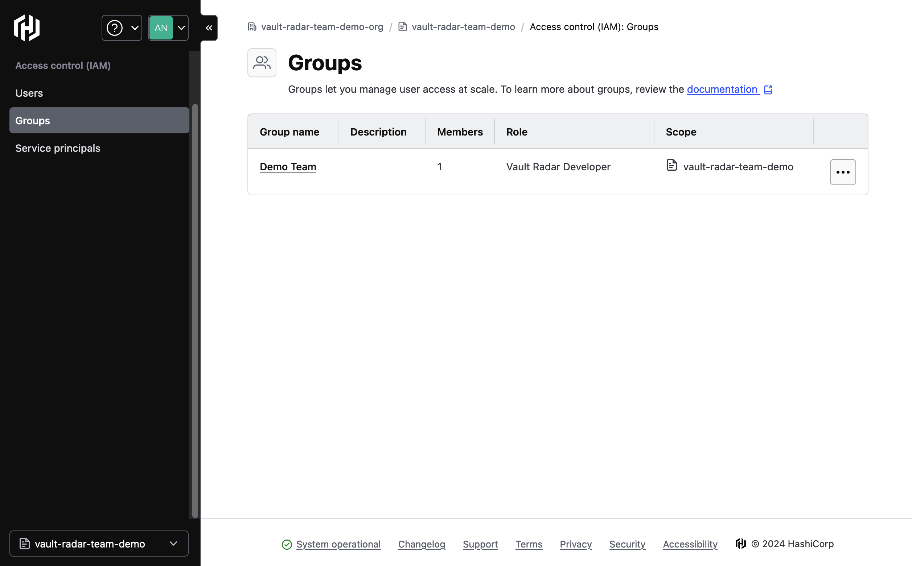

# RBAC (Private Beta)

Vault radar supports RBAC at the resource level, allowing admin users to manage the access of a group's permissions to individual resources.

## Setup Overview

1. [Create a group for the organization](#create-a-group-for-the-organization)
2. [Add members to the group](#add-members-to-the-group)
3. [Create a project level group](#create-a-project-level-group)
4. [Assign a Vault Radar developer role to the group](#assign-a-vault-radar-developer-role-to-the-group)
5. [Add Vault Radar resources to the project level group](#add-vault-radar-resources-to-a-project-level-group)

### Create a group for the organization
1. Navigate to the organizations page within HCP and click on an organization 
2. Within the organization, navigate to the Access Control page 
3. Within the access control page for the organization, navigate to the Groups page 
4. Click create group 
5. Enter a name for the group and submit 

### Add members to the group
6. Click Add Members 
7. Select your group members and click Submit 

### Create a project level group
8. Navigate to a project page within your organization 
9. Click on a project within your organization 
10. Within the project, navigate to the Access Control page 
11. Within the access control page of the project, navigate to the Groups page 
12. Within the Groups page, click "Add Groups" 
13. Select the organization level group(s) that you would like to add and click "Add Selected Groups" 

### Assign a Vault Radar developer role to the group
14. Click on the select service dropdown 
15. Select Vault Radar service from the dropdown 
16. Click on the select role dropdown 
17. Select the Vault Radar Developer role from dropdown 
18. Click Add Groups   
You now have a project configured to use Vault Radar RBAC 

### Add Vault Radar resources to a project level group
19. Within the Vault Radar application, navigate to Resources 
20. Select the resources that you wish to setup RBAC for and click "Add RBAC" 
20. Select the project level group that you wish to give access to the resource(s) 
20. Select the role to apply for the Resource and Group 
The Resource(s) now have RBAC applied 
