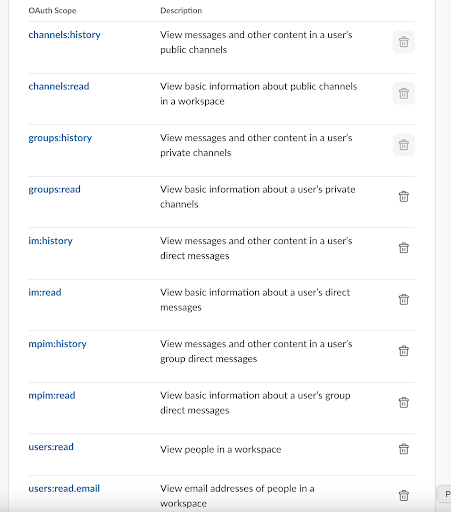
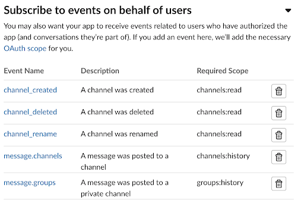

# Add a data source - Slack

> **_NOTE:_**  This feature is currently available as a beta feature. The beta functionality is stable but possibly incomplete and subject to change. We strongly discourage using beta features in production.


Vault Radar allows you to connect to any workspace on [Slack
Cloud](#add-slack-cloud).

## Add Slack Cloud

## Prerequisites

### Set up Slack App

- To create a Slack app, [start by going to Slack's app creation page](https://docs.slack.dev/quickstart/#creating) and click on **Create App**

### Requesting scopes for the Slack App
    
After the Slack app is created, we'll need to request scopes for your app. 
Scopes give the app permission to perform actions, such as reading Slack messages and replies.
To request scopes, open the  App and click on **OAuth & Permissions** in the app management page.
1. Within **OAuth & Permissions**, scroll down to Scopes.
1. Under **User Token Scopes**, Select **Add an OAuth Scope** and add the following scopes.
    

### Install and Authorize Slack App

Once the OAuth scopes are requested, the Slack app has to be installed onto the workspace to get the access token.

1. Open the Slack app and click on **OAuth & Permissions** section in the app management page
1. Install the Slack app by selecting the **Install to Workspace** button, under the section **OAuth Tokens**
1. The Slack OAuth flow will start. Select **Allow** on the following screen to continue to install the Slack app.

### Obtain Slack OAuth User Token

After installation, navigate back to the **OAuth & Permissions** page. An **User OAuth Token** should be seen under the section **OAuth Tokens**.
Copy the **User OAuth Token**


### Slack Signing secret

The signing secret is used to validate webhooks received from Slack (also called as Events in Slack terminology). 

To view and copy the signing secret:
1. Open the Slack app and click on the **Basic Information** section of the app management page
2. Click on the **Show** button in the Signing Secret field found on the right pane
3. Copy the value that will need to be entered in the **Enter Slack signing secret** text field

## Create a connection with Slack Cloud

### Scan with HCP Cloud

1. Select **Settings/Data Sources**.

1. Select **HCP Vault Radar Scan** and click **Continue**.

1. Under Team Collaboration, Click on the **Slack** button.

1. Enter the Slack workspace name in the **Enter your Slack Workspace name** text field.

2. Enter the Slack user OAuth access token in the **Enter your Slack user OAuth token** text field. Refer [here](#obtain-slack-oauth-user-token)

3. Enter the Slack signing secret in the **Enter your Slack signing secret** text field. Refer [here](#slack-signing-secret)

4. Click **Next**.

## Add channels to Vault Radar

1. Once you establish a connection, select either **All active channels** or **Select channels to monitor** radio button.

1. Click **Finish**. The channels will now begin scanning

<Note>

Vault Radar has a limit of 5000 channels per workspace. If you have more
than 5000 channels, Vault Radar will select the 5000 channels with the
most recent activity.

</Note>

### Scan with agent

1. Click **Settings**, then click **Data Sources**.

1. Click **Add data source**.

1. Select **Vault Radar Agent Scan**.

1. Under Team Collaboration, Click on the **Slack** button.

1. Enter the Slack workspace name in the **Enter your Slack Workspace name** text field.

2. Enter the Slack signing secret in the **Enter your Slack signing secret** text field. Refer [here](#slack-signing-secret)

3. Create an environment variable for the Slack OAuth user token in the agent environment. To copy the token, refer [here](#obtain-slack-oauth-user-token)
   
   **Example:**

   <CodeBlockConfig hideClipboard>

   ```shell-session
   $ export SLACK_OAUTH_USER_TOKEN=<copy-token/>
   ```

   </CodeBlockConfig>

4. Enter the environment variable in the **Environment Path** text field with the `env://` prefix.
   
   Example:
   
   ```plaintext
   env://SLACK_OAUTH_USER_TOKEN
   ```

5. Click **Next**.

6. Select either the **All active channels** or **Select channels to monitor** radio
   button.

7. Click **Finish**. The channels will now begin scanning.

## Assign a group to a resource

@include 'vault-radar/add-group-to-resource.mdx'


## Configuring the app for event listening


Slack apps listen and respond to events from your workspace. To enable webhooks for the Slack app, configure it to respond to events
such as when a message is posted to a channel or when a new channel is created.<br/><br/>
To configure the Slack app to respond to events

1. Open the Slack app and Select **Event Subscriptions** from the app management page
1. Toggle **Enable events** to ON
1. Within **Subscribe to events on behalf of users**, select **Add Workspace event** and subscribe to the below events

    

2. Set the **Request URL** to a URL where the Vault Radar listens to the incoming HTTP requests.
The **Request URL** is `https://api.cloud.hashicorp.com/2023-05-01/vault-radar/projects/<hashicorp-project-id>/api/webhook-events/code-servers/slack-cloud?org=<slack-workspace>`
   - **project-id** will be available in the portal's URL, and **slack-workspace** is the slack workspace name on where the slack app is installed.

1. Wait for the **Request URL** to display as **Verified** 
