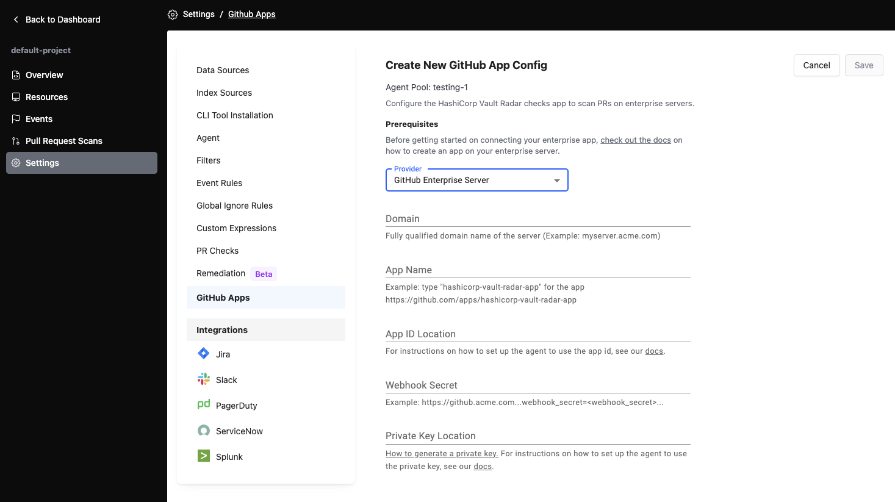

# [Vault Radar](https://developer.hashicorp.com/hcp/docs/vault-radar) GitHub Checks App tools

## Requirements
- [python >= 3.6](https://www.python.org/downloads/)

## Creating a GitHub Enterprise Server App For **HCP Vault Radar** Scanning
1. Run `python3 github-checks-app-on-enterprise-server.py`
2. When prompted, input your enterprise server domain
3. Copy/paste the URL into a browser of your choice
4. Take note of the `webhook_secret=<webhook_secret>` in the URL
    ```
    > python3 creating-github-enterprise-server-app.py
    Enter your GitHub Enterprise Server domain name (i.e. github.companyname.com): github.acme.com
    https://github.acme.com...webhook_secret=Z1KPOYifctpzOjfphKj_hqRlZbrDOBG9AU7hgj7iPrk...
    ```
5. Manually add the `webhook_secret` into the form, since setting webhook secret via query params is no longer supported 
6. Scroll down to click `Create GitHub App`
   
7. Once the app is created, take note of the webhook secret from the URL above, as well as these values from your app settings page
    * app name
    * app ID
    * client ID
    * client secret
     * You will likely have to generate this for the first time
    * private key
      * You will likely have to generate this for the first time
      * The key itself should be downloaded and stored safely on your machine, you will need to open the file to get the value using a text editor or something similar
 
8. Return to the Vault Radar UI, and you should be able to input your app configuration in this form below
 

## Creating a GitHub Cloud App For **HCP Vault Radar** Scanning
Please follow the instructions [here to use the common HashiCorp Vault Radar GitHub App](https://developer.hashicorp.com/hcp/docs/vault-radar/manage/create-pull-request-check-policies#github-cloud).

## Creating a GitHub Cloud App For **Vault Radar Agent** Scanning

1. Run `python3 github-checks-app-on-enterprise-server.py`
2. When prompted enter `github.com`
3. Copy/paste the URL into a browser of your choice
4. Take note of the `webhook_secret=<webhook_secret>` in the URL
    ```
    > python3 creating-github-enterprise-server-app.py
    Enter your GitHub Enterprise Server domain name (i.e. github.companyname.com): github.acme.com
    https://github.acme.com...webhook_secret=Z1KPOYifctpzOjfphKj_hqRlZbrDOBG9AU7hgj7iPrk...
    ```
5. Manually add the `webhook_secret` into the form, since setting webhook secret via query params is no longer supported
6. Remove the `?domain=github.com` from the Webhook URL
7. Scroll down and click `Create GitHub App`
8. Once the app is created, take note of the webhook secret from the URL above, as well as these values from your app settings page:
    * app name
    * app ID
    * client ID
    * client secret
      * You will likely have to generate this for the first time
    * private key
      * You will likely have to generate and download this for the first time
      * The key itself should be downloaded and stored safely on your machine, you will need to open the file to get the value using a text editor or something similar.
9. On the Agent host(s) configure an environment variable with the value of the **private key** from your GitHub App. Use the same variable name on all host(s).
10. In the Radar UI, you can now setup and configure a GitHub App. When adding a new configuration, you should see the option to configure it for HCP or for your Agent like below. If you do not, reach out to your HashiCorp customer support contact for assistance.
 
1.  Then select GitHub Cloud from the drop down and enter your values into the form. For the Private Key Location, the form is expecting a URI to the Private Key. For now we only support Environment Variables. For a variable named `ENV_VAR_1` the URI would be `env://ENV_VAR_1`. With all the information entered hit Save. The app is now configured. [See here for next steps on managing PR Checks and Policies](https://developer.hashicorp.com/hcp/docs/vault-radar/manage/create-pull-request-check-policies#configure-repositories).
 

## Creating a GitHub Enterprise Server App For **Vault Radar Agent** Scanning

1. Run `python3 github-checks-app-on-enterprise-server.py`
2. When prompted, input your enterprise server domain
3. Copy/paste the URL into a browser of your choice
4. Take note of the `webhook_secret=<webhook_secret>` in the URL
    ```
    > python3 creating-github-enterprise-server-app.py
    Enter your GitHub Enterprise Server domain name (i.e. github.companyname.com): github.acme.com
    https://github.acme.com...webhook_secret=Z1KPOYifctpzOjfphKj_hqRlZbrDOBG9AU7hgj7iPrk...
    ```
5. Manually add the `webhook_secret` into the form, since setting webhook secret via query params is no longer supported
6. Scroll down and click `Create GitHub App`
7. Once the app is created, take note of the webhook secret from the URL above, as well as these values from your app settings page:
    * app name
    * app ID
    * client ID
    * client secret
      * You will likely have to generate this for the first time
    * private key
      * You will likely have to generate and download this for the first time
      * The key itself should be downloaded and stored safely on your machine, you will need to open the file to get the value using a text editor or something similar.
8. On the Agent host(s) configure an environment variable with the value of the **private key** and the **app id** from your GitHub App. Use the same variable names on all host(s).
9.  In the Radar UI, you can now setup and configure a GitHub App. When adding a new configuration, you should see the option to configure it for HCP or for your Agent like below. If you do not, reach out to your HashiCorp customer support contact for assistance.
 
1.  Then select GitHub Enterprise Server from the drop down and enter your values into the form. For the Private Key Location and App ID Location, the form is expecting a URI to the variable. For now we only support Environment Variables. For a variable named `ENV_VAR_1` the URI would be `env://ENV_VAR_1`. With all the information entered hit Save. The app is now configured. [See here for next steps on managing PR Checks and Policies](https://developer.hashicorp.com/hcp/docs/vault-radar/manage/create-pull-request-check-policies#configure-repositories).
 
